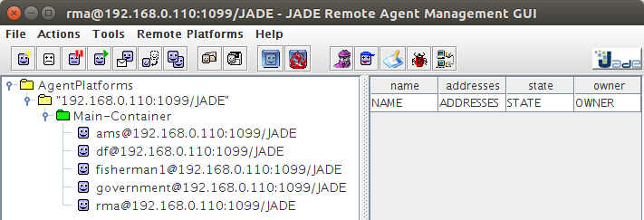

# Legislative simulation - JADE

Projeto de testes e aprendizado com simulações sociais avaliando ações dos agentes através de consultas sobre leis em ontologias. Utiliza o middleware [AgentDevLaw](https://github.com/fabiosperotto/agentdevlaw) em seu último release. Usa como plataforma o ambiente [JADE](https://jade.tilab.com).

## Configuração

Na IDE Eclipse, é necessário especificar uma nova configuração de execução:
- Na aba Main em Main class informe jade.Boot
- Na aba Arguments em program arguments informe: -gui government:law_simulation.Government;fisherman1:law_simulation.Fisherman

Se precisar alterar a porta de execução do sistema, informe antes dos agentes a nova porta, exemplo: -gui -local-port 1111 government:law_simulation.Government;fisherman1:law_simulation.Fisherman

No diretório jade-bin existem os binários do próprio framework JADE e do middleware agentdevlaw que processa as informações legislativas da ontologia legal fornecida (/ontologies). Inclua os binários através da sua IDE clicando em cima da de cada um com botão direito > Build Path > Add to Build Path.


O arquivo config.properties descreve a configuração de acesso a ontologia legal.


## Screenshots



JADE GUI with registered agents.

 
Government agent checking the legal ontology and perceive that fishing is prohibited. In this case, he removes the river resource and when the fisherman tries to fish, he cannot find the river and "thinks" this is not possible to do.

 
In this other case, the agent fisherman can fish because the government agent doesn't have a law about it.


### Itens de ajuda

Em caso de encerrar a GUI da plataforma Jade somente fechando a GUI (sem encerrar a simulação) ocasionará do serviço ainda permanecer ativo, gerando problemas como "porta em uso" quando for executar novamente o projeto. Procure sempre clicar em File > "Shut down Agent platform" para finalizar JADE corretamente. Para resolver o processo suspenso no SO, no linux você pode executar:

```bash
$ sudo netstat -tupln #lista quais processos estao rodando em quais portas (procure por um processo java)
$ lsof -ni :1111 #versao mais direta que a anterior caso souber que o sistema esta rodando na porta 11111$ sudo kill $(lsof -t -i:1111) #mata o processo que estiver rodando na porta 1111 verificada em um dos comandos anteriores
````